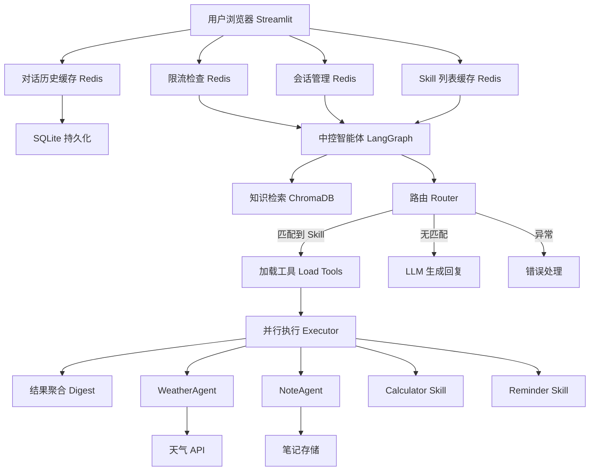

```markdown
#  个人生活助手 — 企业级多Agent协作框架

[](https://www.python.org/)
[](https://langchain.com/langgraph)
[](https://fastapi.tiangolo.com/)
[](https://redis.io/)
[](https://www.deepseek.com/)
[](https://www.trychroma.com/)
[](https://streamlit.io/)
[](LICENSE)

基于 **Harness Agent 范式** 与 **多Agent协作** 设计的企业级智能助手系统。  
主Agent（LangGraph 编排）负责任务分解、意图路由和结果聚合；子Agent（WeatherAgent、NoteAgent 等）独立封装业务逻辑，通过标准化接口协同工作。  
系统集成 **MCP 协议**、**Redis 多层缓存**、**熔断/限流/降级**、**经验池自进化**、**向量知识库** 等生产级能力，是一个从架构设计到工程落地的完整 Agent 基础设施。

> 这不仅仅是一个 LLM 调用 Demo，而是一个可学习、可复用、可展示的企业级多智能体系统。

---

##  核心设计

- **多Agent协作**：主Agent 基于 LangGraph 进行显式状态图编排；子Agent（WeatherAgent、NoteAgent）独立执行任务，对外暴露统一接口，可独立扩展与替换。
- **协议驱动**：所有 Skill 和子Agent 遵循 MCP（Meta Control Protocol）基类，输出格式强制统一。
- **自进化能力**：成功执行的任务自动记录到经验池（SQLite + 向量相似度匹配），后续相似问题优先复用成功参数。
- **可靠性内建**：熔断器（Redis 持久化）、指数退避重试、三级降级、幂等性、滑动窗口限流。
- **生产级特性**：会话管理（Redis）、多用户隔离、对话记忆缓存（Redis + SQLite）、ChromaDB 用户偏好存储、自动化评估、日志持久化。

---

##  系统架构



**数据层架构：**
- **Redis**：热数据缓存、状态共享、限流
- **SQLite**：用户、对话、笔记、经验池 持久化
- **ChromaDB**：用户偏好向量知识库

---

##  功能特性

###  多技能智能体
- **计算器**：基于栈的后缀表达式，支持括号、幂运算、取模，自动处理全角符号和 Markdown 转义。
- **提醒助手**：自然语言提取提醒内容和时间，可并行与其他 Skill 协作。
- **天气查询**：接入百度天气 API，支持默认城市管理与记忆，用户城市偏好持久化。
- **笔记记录**：多分类笔记存储，Redis 缓存热数据。

###  多Agent协作与自进化
- **主Agent** 基于 LangGraph 的 6 节点状态图进行意图识别和任务分解。
- **子Agent**（WeatherAgent、NoteAgent）独立封装业务逻辑，可被主Agent 灵活调用。
- **经验池**：成功任务自动记录，通过向量相似度匹配复用历史成功参数，实现“越用越聪明”。

###  Redis 集成
- **对话记忆**：Redis List 缓存 + 写穿透至 SQLite，7 天过期。
- **Skill 列表**：30 秒缓存，自动刷新。
- **熔断器状态**：Redis Hash 持久化，重启不丢失，多实例共享。
- **限流**：滑动窗口（Redis Sorted Set），60 秒内最多 10 次请求。
- **会话管理**：Redis Hash 存储用户会话，支持多用户隔离。

###  生产级可靠性
- 熔断器状态机（CLOSED → OPEN → HALF_OPEN），指数退避重试，三级降级策略，幂等性保证。
- 全局日志系统：`structlog` + 文件轮转（`logs/agent.log`），前端实时查看。

###  上下文记忆与向量知识库
- ChromaDB 存储用户偏好，检索结果优先于 Skill 调用。
- 对话历史自动注入 LLM，支持多轮上下文理解。

###  自动化评估
5 维评分体系：功能正确性、回答可用性、格式规范性、执行安全性、响应速度。  
附带回归测试数据集。

---

##  快速开始

### 使用 Docker 一键部署

```bash
# 1. 克隆项目
git clone https://github.com/你的用户名/life-assistant.git
cd life-assistant

# 2. 配置 API 密钥
cp .env.example .env
# 编辑 .env，填入你的 DEEPSEEK_API_KEY 和 BAIDU_WEATHER_AK

# 3. 一键启动
docker compose -f docker/docker-compose.yml up -d

# 4. 访问
浏览器打开 http://localhost:8501

# 5. 停止
docker compose -f docker/docker-compose.yml down


### 环境要求
- Python 3.11+
- Redis 7.0+
- 百度地图 API 密钥
- DeepSeek API 密钥

### 1. 克隆项目
```bash
git clone https://github.com/你的用户名/life-assistant.git
cd life-assistant
```

### 2. 安装依赖
```bash
uv sync
```

### 3. 配置环境变量
```bash
cp .env.example .env
```
编辑 `.env`，填入你的 API 密钥和 Redis 地址。

### 4. 启动 Redis
```bash
redis-server
```

### 5. 启动后端服务
```bash
uv run python run_all.py
```

### 6. 启动前端
```bash
uv run streamlit run src/app.py
```
浏览器访问 `http://localhost:8501` 即可开始对话。

---

##  项目结构

```
life-assistant/src/
├── protocol/              # MCP 协议层（统一输出基类）
├── config/                # 全局配置、日志系统、提示词
├── skill_registry/        # Skill 注册中心（含 Redis 缓存、熔断管理）
├── skills/                # 4 个 Skill 微服务
│   ├── calculator/        # 计算器（栈实现）
│   ├── reminder/          # 提醒
│   ├── weather/           # 天气（百度API）
│   └── note/              # 笔记
├── sub_agents/            # 子Agent（多Agent协作）
│   ├── base.py            # 子Agent基类
│   ├── weather_agent.py   # 天气子Agent
│   └── note_agent.py      # 笔记子Agent
├── central_agent/         # 主Agent（LangGraph 编排）
├── knowledge/             # ChromaDB 向量知识库
├── resilience/            # 熔断、重试、降级、限流
├── infrastructure/        # Redis 客户端（异步+同步）
├── evaluation/            # 5 维评估体系
├── memory/                # 对话记忆（Redis + SQLite）
├── storage/               # SQLite 数据模型 + 经验池
├── auth/                  # JWT 认证（预留）
├── logs/                  # 日志文件（运行时生成）
├── app.py                 # Streamlit 前端
├── run_all.py             # 一键启动所有服务
├── eval.py                # 评估入口
└── main.py                # 测试示例
```

---

##  测试与评估

- **回归测试**：
  ```bash
  uv run pytest tests/ -v
  ```
- **5 维评估**：
  ```bash
  uv run python eval.py
  ```
  输出通过率、各维度均分、失败用例详情。

---


该项目可证明具备以下能力：
1. **架构设计**：Harness Agent 模式、多Agent协作、MCP 协议、微服务化工具。
2. **框架运用**：LangGraph 状态图编排、子Agent封装。
3. **可靠性工程**：熔断、重试、降级、幂等、限流完整实现。
4. **缓存与状态管理**：Redis 热数据缓存、写穿透、分布式熔断器。
5. **自进化系统**：经验池与向量匹配，让 Agent 越用越聪明。
6. **工程化素养**：模块化结构、配置分离、日志系统、自动化评估、多用户会话管理。

---

## 📜 许可证

本项目基于 [MIT License](LICENSE) 开源。
```
